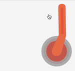

# snabbdom-valve

An interactive, physically based ball valve handle component implemented in snabbdom.




## features

* renders with svg
* handle with spring modeled movement
* optional, subtle sound effect support for more impactful experience
* data oriented, functional design
* tiny! (~ 250 lines of code)


## usage

```javascript
import html  from 'https://cdn.skypack.dev/snabby'
import valve from 'https://cdn.skypack.dev/snabbdom-valve'


let currentVnode = document.querySelector('main') // where to inject the tabs panel

const model = valve.init({
	// optional sound array, you can provide sound effects.
	// you can provide multiple items in an array and one will be chosen at run time.
    sounds: {
    	done: [ '/handle-done.wav' ],
    	click: [ '/click-1.wav' ]
    }
})


function view (model, update) {
    return html`<main>
        ${valve.view(model, update)}
    </div>`
}


function update () {
    const newVnode = view(model, update)
    currentVnode = html.update(currentVnode, newVnode)
}


update()
```


### cleanup

if you declare audio in the model, you should destroy the component when you're done with it, to free those resources.

```javascript
valve.destroy(model)
```


## TODO
* play the in-between audio clicks more uniformly
* cleanup audio resources on `destroy`
* fix the handle positioning within the viewbox
* arrows indicating available handle motion


## Notes Links and References

* https://burakkanber.com/blog/physics-in-javascript-car-suspension-part-1-spring-mass-damper/
* https://www.joshwcomeau.com/animation/a-friendly-introduction-to-spring-physics/
* https://freesound.org/
* https://easings.net/
